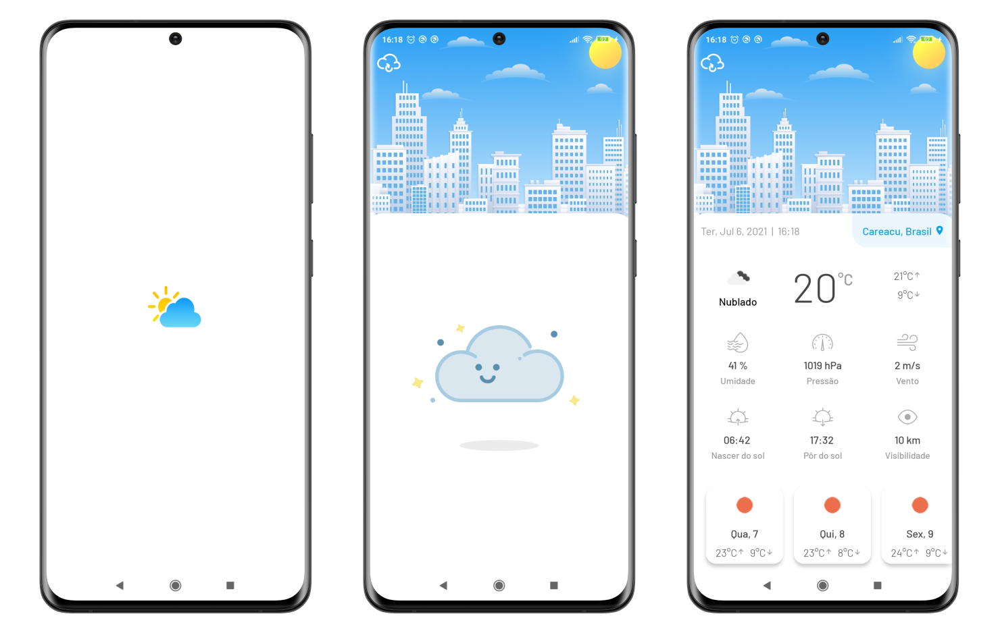

<h1 align="center">
    
</h1>

<p align="center">
 

  
</p>

<p align="center">
  <a href="#computer-projeto">Projeto</a>&nbsp;&nbsp;&nbsp;|&nbsp;&nbsp;&nbsp;
  <a href="#rocket-tecnologias">Tecnologias</a>&nbsp;&nbsp;&nbsp;|&nbsp;&nbsp;&nbsp;
  <a href="#warning-atenção">Atenção</a>&nbsp;&nbsp;&nbsp;|&nbsp;&nbsp;&nbsp;
  <a href="#information_source-como-rodar">Como rodar</a>&nbsp;&nbsp;&nbsp;|&nbsp;&nbsp;&nbsp;
  <a href="#thinking-como-contribuir">Como contribuir</a>&nbsp;&nbsp;&nbsp;|&nbsp;&nbsp;&nbsp;
  <a href="#memo-licença">Licença</a>&nbsp;&nbsp;&nbsp;|&nbsp;&nbsp;&nbsp;
  <a href="#mailbox_with_mail-contato">Contato</a>
  </p>

## :computer: Projeto

 O foco desse aplicativo é consultar alguns dados climáticos de acordo com a localização atual do usuário. Foi usado como provedor de dados a API do [Open Weather Map](https://openweathermap.org/).

<p align="center">
  
</p>

## :rocket: Tecnologias

Principais tecnologias e bibliotecas utilizadas até agora:

-   [React Native](https://reactnative.dev/)
-   [React Query](https://react-query.tanstack.com/)
-   [Expo Unimodules](https://docs.expo.io/bare/installing-unimodules/)
-   [Styled Components](https://styled-components.com/)
-   [Lottie](https://airbnb.io/lottie/#/README)
-   [Typescript](https://www.typescriptlang.org/)
-   [Axios](https://www.npmjs.com/package/axios)
-   [Day.js](https://day.js.org/)
-   [Expo Google Fonts](https://github.com/expo/google-fonts)
-   [Expo Location](https://docs.expo.io/versions/latest/sdk/location/)
-   [ESLint](https://eslint.org/)
-   [Prettier](https://prettier.io/)


## :information_source: Como rodar

### Requisitos

* [Configurar React Native](https://reactnative.dev/docs/environment-setup)

### Clone o repositório e acesse a pasta

```bash
$ git clone https://github.com/willerrodrigo/weather.git && cd weather
```

### Crie um arquivo .env de acordo com o [env.example](https://github.com/willerrodrigo/weather/blob/main/.env.example) e obtenha sua [chave](https://home.openweathermap.org/users/sign_in)

```bash
WEATHER_API_KEY=
```

### Na raiz do projeto

```bash
$ yarn
# Android
$ yarn android
# Ios
$ yarn ios
```

## :thinking: Como contribuir

- Faça um fork desse repositório;
- Cria uma branch com a sua feature: `git checkout -b minha-feature`;
- Faça commit das suas alterações: `git commit -m 'feat: Minha nova feature'`;
- Faça push para a sua branch: `git push origin minha-feature`.

Depois que o merge da sua pull request for feito, você pode deletar a sua branch.

## :memo: Licença

Esse projeto está sob a licença MIT. Veja o arquivo [LICENSE](LICENSE) para mais detalhes.

## :mailbox_with_mail: Contato

<a href="https://www.linkedin.com/in/willer-rodrigo-silva-b23b0116a" target="_blank" >
  
</a>&nbsp;&nbsp;&nbsp;

---

Feito com ♥ by Willer Silva
